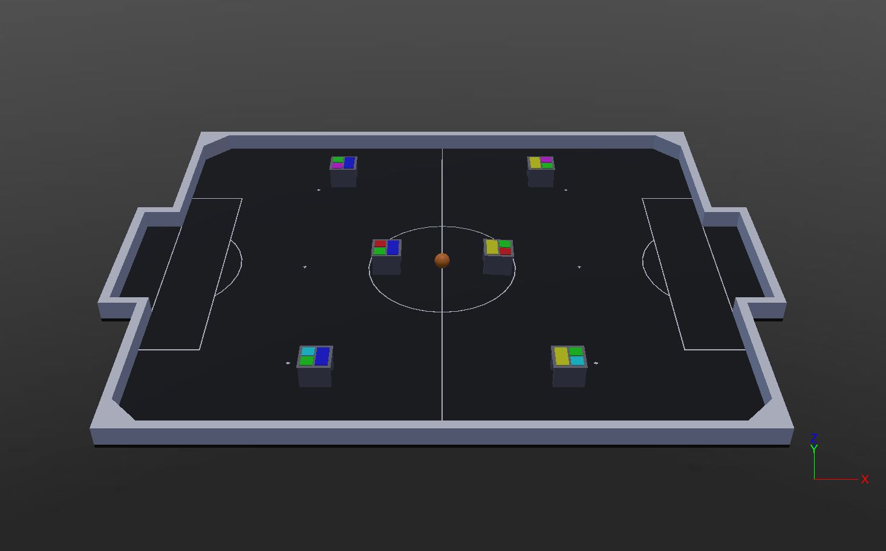

<h1 align="center">🥅 TraveSim</h1>
<p align="center">IEEE Very Small Size Soccer simulation project with Webots</p>

<p align="center">


<!-- ALL-CONTRIBUTORS-BADGE:START - Do not remove or modify this section -->

<!-- ALL-CONTRIBUTORS-BADGE:END -->

</p>

<!-- TOC -->

- [📷 Screenshots](#-screenshots)
- [🎈 Intro](#-intro)
- [➕ Dependencies](#-dependencies)
- [🐳 Docker](#-docker)
- [🌎 Worlds](#-worlds)
- [📣 Communication](#-communication)
  - [💡 Sample client](#-sample-client)
- [📏 Used models](#-used-models)
  - [📜 Main parameters](#-main-parameters)
  - [⚙️ Motor parameters](#-motor-parameters)
  - [🛠️ Customize the robot model](#-customize-the-robot-model)
- [📁 Folder structure](#-folder-structure)
- [📝 Contributing](#-contributing)
- [✨ Contributors](#-contributors)

<!-- /TOC -->

## 📷 Screenshots

<p align="center">
  
</p>

## 🎈 Intro

This project is the spiritual successor of the [classic Travesim](https://github.com/ThundeRatz/travesim)

The environment is built upon [Webots](https://cyberbotics.com/), an open source general purpouse robotics simulator

In order to init the simulation, run the command:

```bash
webots <world-file>
```

To init a 3v3 match:

```bash
webots worlds/Match3v3.wbt
```

## ➕ Dependencies

Install [Webots](https://cyberbotics.com/doc/guide/installation-procedure#installing-the-debian-package-with-the-advanced-packaging-tool-apt) in your system. For Debian distros, you may run:

```bash
sudo mkdir -p /etc/apt/keyrings
cd /etc/apt/keyrings
sudo wget -q https://cyberbotics.com/Cyberbotics.asc

echo "deb [arch=amd64 signed-by=/etc/apt/keyrings/Cyberbotics.asc] https://cyberbotics.com/debian binary-amd64/" | sudo tee /etc/apt/sources.list.d/Cyberbotics.list
sudo apt update

sudo apt install -y webots cmake libboost-system-dev libboost-thread-dev protobuf-compiler
```

> [!WARNING]
> If you install Webots with a different method, you need to set `WEBOTS_HOME` environment variable accordingly

Then, clone the repo with:

```bash
git clone https://github.com/futebol-mini/travesim.git
```

At last, compile the controllers with:

```bash
cd travesim
make
```

## 🐳 Docker

To run the project with docker, use the command

```bash
docker run --rm \
    --net=host \
    --gpus=all \
    -e DISPLAY \
    -v /tmp/.X11-unix:/tmp/.X11-unix:ro \
    -v $XAUTHORITY:/root/.Xauthority:ro \
    --name travesim \
    ghcr.io/futebol-mini/travesim
```

It's possible to build the image locally with

```bash
docker build . -t travesim
```

Then run it with

```bash
docker run --rm \
    --net=host \
    --gpus=all \
    -e DISPLAY \
    -v /tmp/.X11-unix:/tmp/.X11-unix:ro \
    -v $XAUTHORITY:/root/.Xauthority:ro \
    --name travesim \
    travesim
```

## 🌎 Worlds

In the current version, TraveSim can handle games with 3 or 5 robots per team.

The worlds currently supported are as follows:

- `Match3v3.wbt` - Base world for 3v3 matches
- `Match5v5.wbt` - Base world for 5v5 matches
- `RobotDev.wbt` - Development world with a single robot

## 📣 Communication

All TraveSim controllers adhere the [VSSProto](https://github.com/futebol-mini/VSSProto) standard, built upon Google's Protocol Buffers.

| Name        | IP address  |  Port   |
|:------------|:-----------:|:-------:|
| Replacer    | `127.0.0.1` | `20011` |
| Yellow Team | `127.0.0.1` | `20012` |
| Blue Team   | `127.0.0.1` | `20013` |
| Vision      | `224.0.0.1` | `10002` |

### 💡 Sample client

A minimal client written in python [is provided as example](https://github.com/futebol-mini/VSSClient.py). It receives information from the simulation and sends commands for each one of the robots.

It's built with [VSSProto.py](https://github.com/futebol-mini/VSSProto.py), the python library for VSSProto use.

## 📏 Used models

TraveSim uses the model of a generic VSS robot, defined in `protos/GenericVssRobot.proto`.

Robot's color pattern follows the standard specified in the IEEE Latin American Robotics Competition rules

### 📜 Main parameters

The physical propoerties of the robot where determined from typical materials used in real world robot manufacturing

|         Parameter          |          Value | Unit  |
|:--------------------------:|---------------:|:------|
|        Wheel radius        |             25 | mm    |
|      Wheel thickness       |              8 | mm    |
|     Wheels separation      |             55 | mm    |
|       Wheels density       |           1150 | kg/m³ |
|     Wheels mass (each)     |             18 | g     |
|      Wheels material       |          Nylon | \-    |
|       Body material        | 50% infill ABS | \-    |
|        Body density        |            510 | kg/m³ |
|        Total height        |             62 | mm    |
|        Total width         |             78 | mm    |
|        Total length        |             78 | mm    |
|         Total mass         |            180 | g     |
| Total inertia momentum Izz |          0.113 | g m²  |

### ⚙️ Motor parameters

The model's motor is inspired in [Pololu's 50:1 Micro Metal Gearmotor](https://www.pololu.com/product/3073) in order to achieve realistic values.

|           Parameter            | Value | Unit   |
|:------------------------------:|------:|:-------|
|        Motor max torque        |    73 | mN m   |
| Robot max linear acceleration  |    16 | m/s²   |
| Robot max angular acceleration |  1420 | rad/s² |
|        Motor max speed         |   650 | RPM    |
|        Motor max speed         |    68 | rad/s  |
|     Robot max linear speed     |   1.7 | m/s    |
|    Robot max angular speed     |   9.8 | rad/s  |

### 🛠️ Customize the robot model

The following parameters may be altered in order to modify the dynamic behavior of the model

- `wheelRadius` - Wheel radius in meters. Default value: `0.025`
- `wheelThickness` - Wheel thickness in meters. Default value: `0.008`
- `leftWheelTranslation` - Position of the center of the left wheel in relation to the center of the bottom face of the body in meters. Default value: `0.0  0.0275 0.023`
- `rightWheelTranslation` - Position of the center of the left wheel in relation to the center of the bottom face of the body in meters. Default value: `0.0 -0.0275 0.023`
- `wheelMass` - Mass of each wheel in kilograms. Default value: `0.018`
- `bodyMass` - Mass of the robot body in kilograms. Default value: `0.144`

An exemple on how to declare a robot with custom parameters is shown in `protos/CustomVssRobot.proto`

To use them in a simulation, a new world file should be created, replacing `GenericVssRobot` with the custom robot model name

## 📁 Folder structure

- **controllers/** - Webots controllers folder
  - **common/** - Interfaces common to all controllers. Schema for messages sent via [Webots emitters](https://www.cyberbotics.com/doc/reference/emitter).
  - **referee_controller/** - [Webots supervisor](https://www.cyberbotics.com/doc/reference/supervisor) to bridge teams and referee commands to the simulation.
  - **vss_robot_controller/** - Controller of the individual robots.
- **protos/** - [Webots PROTO files](https://cyberbotics.com/doc/reference/proto) that describe the field, ball and field.
- **worlds/** - [Webots world files](https://cyberbotics.com/doc/reference/webots-world-files) for match simulation

## 📝 Contributing

Any help in the development of robotics is welcome, we encourage you to contribute to the project! To learn how, see the [contribution guidelines](CONTRIBUTING.md).

## ✨ Contributors

<!-- ALL-CONTRIBUTORS-LIST:START - Do not remove or modify this section -->
<!-- prettier-ignore-start -->
<!-- markdownlint-disable -->
<table>
  <tbody>
    <tr>
      <td align="center" valign="top" width="14.28%"><a href="https://github.com/FelipeGdM"><br /><sub><b>Felipe Gomes de Melo</b></sub></a><br /><a href="https://github.com/futebol-mini/travesim/commits?author=FelipeGdM" title="Documentation">📖</a> <a href="https://github.com/futebol-mini/travesim/pulls?q=is%3Apr+reviewed-by%3AFelipeGdM" title="Reviewed Pull Requests">👀</a> <a href="https://github.com/futebol-mini/travesim/commits?author=FelipeGdM" title="Code">💻</a> <a href="#translation-FelipeGdM" title="Translation">🌍</a></td>
      <td align="center" valign="top" width="14.28%"><a href="https://github.com/LucasHaug"><br /><sub><b>Lucas Haug</b></sub></a><br /><a href="https://github.com/futebol-mini/travesim/pulls?q=is%3Apr+reviewed-by%3ALucasHaug" title="Reviewed Pull Requests">👀</a> <a href="https://github.com/futebol-mini/travesim/commits?author=LucasHaug" title="Code">💻</a> <a href="#translation-LucasHaug" title="Translation">🌍</a> <a href="https://github.com/futebol-mini/travesim/commits?author=LucasHaug" title="Documentation">📖</a></td>
      <td align="center" valign="top" width="14.28%"><a href="https://github.com/Tocoquinho"><br /><sub><b>tocoquinho</b></sub></a><br /><a href="#ideas-Tocoquinho" title="Ideas, Planning, & Feedback">🤔</a> <a href="https://github.com/futebol-mini/travesim/commits?author=Tocoquinho" title="Documentation">📖</a></td>
      <td align="center" valign="top" width="14.28%"><a href="https://github.com/Berbardo"><br /><sub><b>Bernardo Coutinho</b></sub></a><br /><a href="https://github.com/futebol-mini/travesim/pulls?q=is%3Apr+reviewed-by%3ABerbardo" title="Reviewed Pull Requests">👀</a> <a href="https://github.com/futebol-mini/travesim/commits?author=Berbardo" title="Code">💻</a> <a href="https://github.com/futebol-mini/travesim/commits?author=Berbardo" title="Documentation">📖</a></td>
      <td align="center" valign="top" width="14.28%"><a href="https://github.com/lucastrschneider"><br /><sub><b>Lucas Schneider</b></sub></a><br /><a href="https://github.com/futebol-mini/travesim/pulls?q=is%3Apr+reviewed-by%3Alucastrschneider" title="Reviewed Pull Requests">👀</a> <a href="https://github.com/futebol-mini/travesim/commits?author=lucastrschneider" title="Code">💻</a> <a href="#translation-lucastrschneider" title="Translation">🌍</a> <a href="https://github.com/futebol-mini/travesim/commits?author=lucastrschneider" title="Documentation">📖</a></td>
      <td align="center" valign="top" width="14.28%"><a href="https://github.com/JuliaMdA"><br /><sub><b>Júlia Mello</b></sub></a><br /><a href="#design-JuliaMdA" title="Design">🎨</a> <a href="#data-JuliaMdA" title="Data">🔣</a></td>
      <td align="center" valign="top" width="14.28%"><a href="https://github.com/ThallesCarneiro"><br /><sub><b>ThallesCarneiro</b></sub></a><br /><a href="#design-ThallesCarneiro" title="Design">🎨</a> <a href="#data-ThallesCarneiro" title="Data">🔣</a></td>
    </tr>
    <tr>
      <td align="center" valign="top" width="14.28%"><a href="https://github.com/TetsuoTakahashi"><br /><sub><b>TetsuoTakahashi</b></sub></a><br /><a href="#ideas-TetsuoTakahashi" title="Ideas, Planning, & Feedback">🤔</a></td>
      <td align="center" valign="top" width="14.28%"><a href="https://github.com/GabrielCosme"><br /><sub><b>Gabriel Cosme Barbosa</b></sub></a><br /><a href="https://github.com/futebol-mini/travesim/pulls?q=is%3Apr+reviewed-by%3AGabrielCosme" title="Reviewed Pull Requests">👀</a></td>
      <td align="center" valign="top" width="14.28%"><a href="https://github.com/RicardoHonda"><br /><sub><b>RicardoHonda</b></sub></a><br /><a href="https://github.com/futebol-mini/travesim/pulls?q=is%3Apr+reviewed-by%3ARicardoHonda" title="Reviewed Pull Requests">👀</a></td>
      <td align="center" valign="top" width="14.28%"><a href="https://github.com/leticiakimoto"><br /><sub><b>leticiakimoto</b></sub></a><br /><a href="https://github.com/futebol-mini/travesim/pulls?q=is%3Apr+reviewed-by%3Aleticiakimoto" title="Reviewed Pull Requests">👀</a></td>
    </tr>
  </tbody>
</table>

<!-- markdownlint-restore -->
<!-- prettier-ignore-end -->

<!-- ALL-CONTRIBUTORS-LIST:END -->
